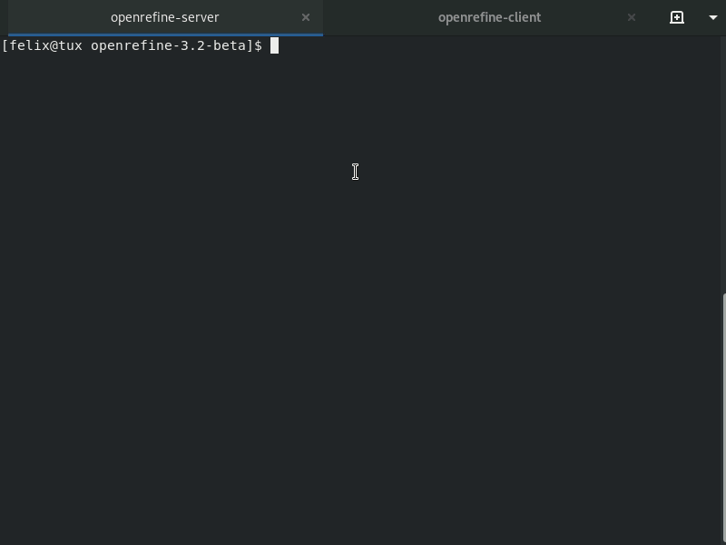

# OpenRefine Python Client with extended command line interface

[](https://www.codacy.com/app/felixlohmeier/openrefine-client?utm_source=github.com&amp;utm_medium=referral&amp;utm_content=opencultureconsulting/openrefine-client&amp;utm_campaign=Badge_Grade) [](https://hub.docker.com/r/felixlohmeier/openrefine-client/) [](https://pypi.org/project/openrefine-client/) [](https://mybinder.org/v2/gh/betatim/openrefineder/22fbb07?filepath=openrefine-client.ipynb)

The [OpenRefine Python Client from PaulMakepeace](https://github.com/PaulMakepeace/refine-client-py) provides a library for communicating with an [OpenRefine](http://openrefine.org) server.
This fork extends the command line interface (CLI) and is distributed as a convenient one-file-executable (Windows, Linux, macOS).
It is also available via Docker Hub, PyPI and Binder.

## Download

One-file-executables:

- Windows: [openrefine-client_0-3-7_windows.exe](https://github.com/opencultureconsulting/openrefine-client/releases/download/v0.3.7/openrefine-client_0-3-7_windows.exe) (~5 MB)
- macOS: [openrefine-client_0-3-7_macos](https://github.com/opencultureconsulting/openrefine-client/releases/download/v0.3.7/openrefine-client_0-3-7_macos) (~5 MB)
- Linux: [openrefine-client_0-3-7_linux](https://github.com/opencultureconsulting/openrefine-client/releases/download/v0.3.7/openrefine-client_0-3-7_linux) (~5 MB)

For [Docker](#docker) containers, native [Python](#python) installation and free [Binder](#binder) on-demand server see the corresponding chapters below.

## Peek

A short video loop that demonstrates the basic features (list, create, apply, export):



## Usage

Ensure you have [OpenRefine](http://openrefine.org) running (i.e. available at http://localhost:3333 or [another URL](#change-url)).

To use the client:

1. Open a terminal pointing to the folder where you have [downloaded](#download) the one-file-executable (e.g. Downloads in your home directory).

   - Windows: Open PowerShell and enter following command

     ```
     cd ~\Downloads
     ```

   - macOS: Open Terminal (Finder > Applications > Utilities > Terminal) and enter following command

     ```
     cd ~/Downloads
     ```

   - Linux: Open terminal app (Terminal, Konsole, xterm, ...) and enter following command

     ```
     cd ~/Downloads
     ```

2. Make the file executable.

   - Windows: not necessary

   - macOS:

     ```
     chmod +x openrefine-client_0-3-7_macos
     ```

   - Linux:

     ```
     chmod +x openrefine-client_0-3-7_linux
     ```

3. Execute the file.

   - Windows:

     ```
     .\openrefine-client_0-3-7_windows.exe
     ```

   - macOS:

     ```
     ./openrefine-client_0-3-7_macos
     ```

   - Linux:

     ```
     ./openrefine-client_0-3-7_linux
     ```

Using tab completion and command history is highly recommended:

- autocomplete filenames: enter a few characters and press `↹`
- recall previous command: press `↑`

### Basic commands

Execute the client by entering its filename followed by the desired command.

The following example will download two small files ([duplicates.csv](https://raw.githubusercontent.com/opencultureconsulting/openrefine-client/master/tests/data/duplicates.csv) and [duplicates-deletion.json](https://raw.githubusercontent.com/opencultureconsulting/openrefine-client/master/tests/data/duplicates-deletion.json)) into the current directory and will create a new OpenRefine project from file duplicates.csv.

Download example data (`--download`) and create project from file (`--create`):

- Windows:

  ```
  .\openrefine-client_0-3-7_windows.exe --download "https://git.io/fj5hF" --output=duplicates.csv
  .\openrefine-client_0-3-7_windows.exe --download "https://git.io/fj5ju" --output=duplicates-deletion.json
  .\openrefine-client_0-3-7_windows.exe --create duplicates.csv
  ```

- macOS:

  ```
  ./openrefine-client_0-3-7_macos --download "https://git.io/fj5hF" --output=duplicates.csv
  ./openrefine-client_0-3-7_macos --download "https://git.io/fj5ju" --output=duplicates-deletion.json
  ./openrefine-client_0-3-7_macos --create duplicates.csv
  ```

- Linux:

  ```
  ./openrefine-client_0-3-7_linux --download "https://git.io/fj5hF" --output=duplicates.csv
  ./openrefine-client_0-3-7_linux --download "https://git.io/fj5ju" --output=duplicates-deletion.json
  ./openrefine-client_0-3-7_linux --create duplicates.csv
  ```

Other commands:

- list all projects: `--list`
- show project metadata: `--info "duplicates"`
- export project to terminal: `--export "duplicates"`
- apply [rules from json file](http://kb.refinepro.com/2012/06/google-refine-json-and-my-notepad-or.html): `--apply duplicates-deletion.json "duplicates"`
- export project to file: `--export --output=deduped.xls "duplicates"`
- delete project: `--delete "duplicates"`

### Getting help

Check `--help` for further options.

Please file an [issue](https://github.com/opencultureconsulting/openrefine-client/issues) if you miss some features in the command line interface or if you have tracked a bug.
And you are welcome to ask any questions!

### Change URL

By default the client connects to the usual URL of OpenRefine [http://localhost:3333](http://localhost:3333).
If your OpenRefine server is running somewhere else then you may set hostname and port with additional command line options (e.g. http://example.com):

- set host: `-H example.com`
- set port: `-P 80`

### Advanced Templating

The OpenRefine [Templating](https://github.com/OpenRefine/OpenRefine/wiki/Export-As-YAML) supports exporting data in any text format (i.e. to construct JSON or XML).
The graphical user interface offers four input fields:

1. prefix
2. row template
   - supports [GREL](https://github.com/OpenRefine/OpenRefine/wiki/General-Refine-Expression-Language) inside two curly brackets, e.g. `{{jsonize(cells["name"].value)}}`
3. row separator
4. suffix

This templating functionality is available via the openrefine-client command line interface.
It even provides an additional feature for splitting results into multiple files.

To try out the functionality create another project from the example file above.

```
--create duplicates.csv --projectName=advanced
```

The following example code will export...

- the columns "name" and "purchase" in JSON format
- from the project "duplicates"
- for rows matching the regex text filter `^CA$` in column "state"

macOS/Linux Terminal (multi-line input with `\` ):

```
--export "advanced" \
--prefix='{ "events" : [
' \
--template='    { "name" : {{jsonize(cells["name"].value)}}, "purchase" : {{jsonize(cells["purchase"].value)}} }' \
--rowSeparator=',
' \
--suffix='
] }' \
--filterQuery='^CA$' \
--filterColumn='state'
```

Windows PowerShell (multi-line input with `` ` ``; quotes needs to be doubled):

```
--export "advanced" `
--prefix='{ ""events"" : [
' `
--template='    { ""name"" : {{jsonize(cells[""name""].value)}}, ""purchase"" : {{jsonize(cells[""purchase""].value)}} }' `
--rowSeparator=',
' `
--suffix='
] }' `
--filterQuery='^CA$' `
--filterColumn='state'
```

Add the following options to the last command (recall with `↑`) to store the results in multiple files.
Each file will contain the prefix, an processed row, and the suffix.

```
--output=advanced.json --splitToFiles=true
```

Filenames are suffixed with the row number by default (e.g. `advanced_1.json`, `advanced_2.json` etc.).
There is another option to use the value in the first column instead:

```
--output=advanced.json --splitToFiles=true --suffixById=true
```

Because our project "advanced" contains duplicates in the first column "email" this command will store only one file `advanced_danny.baron@example1.com.json`.
When using this option, the first column should contain unique identifiers.

### See also

- Linux Bash script to run OpenRefine in batch mode (import, transform, export): [openrefine-batch](https://github.com/opencultureconsulting/openrefine-batch)
- [Jupyter notebook demonstrating usage in Linux Bash](https://nbviewer.jupyter.org/github/betatim/openrefineder/blob/master/openrefine-client.ipynb)
- Use case [HOS-MetadataTransformations](https://github.com/subhh/HOS-MetadataTransformations): Automated workflow for harvesting, transforming and indexing of metadata using metha, OpenRefine and Solr. Part of the Hamburg Open Science "Schaufenster" software stack.
- Use case [Data processing of ILS data to facilitate a new discovery layer for the German Literature Archive (DLA)](https://doi.org/10.5281/zenodo.2678113): Custom data processing pipeline based on Pandas (a Python library) and OpenRefine.

## Docker

[felixlohmeier/openrefine-client](https://hub.docker.com/r/felixlohmeier/openrefine-client/) [](https://hub.docker.com/r/felixlohmeier/openrefine-client/)

```
docker pull felixlohmeier/openrefine-client:v0.3.7
```

### Option 1: Dockerized client

Run client and mount current directory as workspace:

```
docker run --rm --network=host -v ${PWD}:/data:z felixlohmeier/openrefine-client:v0.3.7
```

The docker option `--network=host` allows you to connect to a local or remote OpenRefine via the host network:

- list projects on default URL (http://localhost:3333)

  ```
  docker run --rm --network=host -v ${PWD}:/data:z felixlohmeier/openrefine-client:v0.3.7 --list
  ```

- list projects on a remote server (http://example.com)

  ```
  docker run --rm --network=host -v ${PWD}:/data:z felixlohmeier/openrefine-client:v0.3.7 -H example.com -P 80 --list
  ```

Usage: same commands as explained above (see [Basic Commands](#basic-commands) and [Advanced Templating](#advanced-templating))

### Option 2: Dockerized client and dockerized OpenRefine

Run openrefine-client linked to a dockerized OpenRefine ([felixlohmeier/openrefine](https://hub.docker.com/r/felixlohmeier/openrefine/) [](https://hub.docker.com/r/felixlohmeier/openrefine)):

1. Create docker network

   ```
   docker network create openrefine
   ```

2. Run server (will be available at http://localhost:3333)

   ```
   docker run -d -p 3333:3333 --network=openrefine --name=openrefine-server felixlohmeier/openrefine:3.2
   ```

3. Run client with some [basic commands](#basic-commands): 1. download example files, 2. create project from file, 3. list projects, 4. show metadata, 5. export to terminal, 6. apply transformation rules (deduplication), 7. export again to terminal, 8. export to xls file and 9. delete project

   ```
   docker run --rm --network=openrefine -v ${PWD}:/data:z felixlohmeier/openrefine-client:v0.3.7 --download "https://git.io/fj5hF" --output=duplicates.csv
   docker run --rm --network=openrefine -v ${PWD}:/data:z felixlohmeier/openrefine-client:v0.3.7 --download "https://git.io/fj5ju" --output=duplicates-deletion.json
   docker run --rm --network=openrefine -v ${PWD}:/data:z felixlohmeier/openrefine-client:v0.3.7 -H openrefine-server --create duplicates.csv
   docker run --rm --network=openrefine -v ${PWD}:/data:z felixlohmeier/openrefine-client:v0.3.7 -H openrefine-server --list
   docker run --rm --network=openrefine -v ${PWD}:/data:z felixlohmeier/openrefine-client:v0.3.7 -H openrefine-server --info "duplicates"
   docker run --rm --network=openrefine -v ${PWD}:/data:z felixlohmeier/openrefine-client:v0.3.7 -H openrefine-server --export "duplicates"
   docker run --rm --network=openrefine -v ${PWD}:/data:z felixlohmeier/openrefine-client:v0.3.7 -H openrefine-server --apply duplicates-deletion.json "duplicates"
   docker run --rm --network=openrefine -v ${PWD}:/data:z felixlohmeier/openrefine-client:v0.3.7 -H openrefine-server --export "duplicates"
   docker run --rm --network=openrefine -v ${PWD}:/data:z felixlohmeier/openrefine-client:v0.3.7 -H openrefine-server --export --output=deduped.xls "duplicates"
   docker run --rm --network=openrefine -v ${PWD}:/data:z felixlohmeier/openrefine-client:v0.3.7 -H openrefine-server --delete "duplicates"
   ```

4. Stop and delete server:

   ```
   docker stop openrefine-server
   docker rm openrefine-server
   ```

5. Delete docker network:

   ```
   docker network rm openrefine
   ```

Customize OpenRefine server:

- If you want to add an OpenRefine startup option you need to repeat the default commands (cf. [Dockerfile](https://hub.docker.com/r/felixlohmeier/openrefine/dockerfile))
  - `-i 0.0.0.0` sets OpenRefine to be accessible from outside the container, i.e. from host
  - `-d /data` sets OpenRefine workspace

- Example for [allocating more memory](https://github.com/OpenRefine/OpenRefine/wiki/FAQ#out-of-memory-errors---feels-slow---could-not-reserve-enough-space-for-object-heap) to OpenRefine with additional option `-m 4G`

  ```
  docker run -d -p 3333:3333 --network=openrefine --name=openrefine-server felixlohmeier/openrefine:3.2 -i 0.0.0.0 -d /data -m 4G
  ```

- The OpenRefine version is defined by the docker tag.
  Check the [DockerHub repository](https://hub.docker.com/r/felixlohmeier/openrefine) for available tags.
  Example for OpenRefine `2.8` with same options as above:

  ```
  docker run -d -p 3333:3333 --network=openrefine --name=openrefine-server felixlohmeier/openrefine:2.8 -i 0.0.0.0 -d /data -m 4G
  ```

- If you want OpenRefine to read and write persistent data in host directory (i.e. store projects) you can mount the container path `/data`. Example for host directory `/home/felix/refine`:

  ```
  docker run -d -p 3333:3333 -v /home/felix/refine:/data:z --network=openrefine name=openrefine-server felixlohmeier/openrefine:2.8 -i 0.0.0.0 -d /data -m 4G
  ```

See also:

- [GitHub Repository](https://github.com/opencultureconsulting/openrefine-docker) for docker container `felixlohmeier/openrefine`
- Linux Bash script to run OpenRefine in batch mode (import, transform, export) with docker containers: [openrefine-batch-docker.sh](https://github.com/opencultureconsulting/openrefine-batch/#docker)

## Python

[openrefine-client](https://pypi.org/project/openrefine-client/) [](https://pypi.org/project/openrefine-client/) (requires Python 2.x)

```
pip install openrefine-client
```

This will install the package `openrefine-client` containing modules in `google.refine`.

A command line script `openrefine-client` will also be installed.

### Option 1: command line script

```
openrefine-client --help
```

Usage: same commands as explained above (see [Basic Commands](#basic-commands) and [Advanced Templating](#advanced-templating))

### Option 2: using cli functions in Python 2.x environment

Import module cli:

```
from google.refine import cli
```

Change URL (if necessary):

```
refine.REFINE_HOST = 'localhost'
refine.REFINE_PORT = 3333
```

Help screen:

```
help(cli)
```

Commands:

* download (e.g. example data):

  ```
  cli.download('https://git.io/fj5hF','duplicates.csv')
  cli.download('https://git.io/fj5ju','duplicates-deletion.json')
  ```

* list projects:

  ```
  cli.ls()
  ```

* create project:

  ```
  p1 = cli.create('duplicates.csv')
  ```

* show metadata:

  ```
  cli.info(p1.project_id)
  ```

* apply rules from file to project:

  ```
  cli.apply(p1.project_id, 'duplicates-deletion.json')
  ```

* export project to terminal:

  ```
  cli.export(p1.project_id)
  ```

* export project to file in xls format:

  ```
  cli.export(p1.project_id, 'deduped.xls')
  ```

* export templating (see [Advanced Templating](#advanced-templating) above):

  ```
  cli.templating(p1.project_id, prefix='''{ "events" : [
  ''', template='''    { "name" : {{jsonize(cells["name"].value)}}, "purchase" : {{jsonize(cells["purchase"].value)}} }''', rowSeparator=''',
  ''', suffix='''
  ] }''')
  ```

* delete project:

  ```
  cli.delete(p1.project_id)
  ```

### Option 3: the upstream way

This fork can be used in the same way as the upstream [Python client library](https://github.com/PaulMakepeace/refine-client-py/).

Some functions in the python client library are not yet compatible with OpenRefine >=3.0 (cf. [issue #19 in refine-client-py](https://github.com/paulmakepeace/refine-client-py/issues/19)).

Import module refine:

```
from google.refine import refine
```

Server Commands:

* set up connection:

  ```
  server1 = refine.Refine('http://localhost:3333')
  ```

- show version:

  ```
  server1.server.get_version()
  server1.server.version
  ```

- list projects:

  ```
  server1.list_projects()
  ```

  - pretty print the returned dict with json.dumps:

    ```
    import json
    print(json.dumps(server1.list_projects(), indent=1))
    ```

- create project (**function was edited in this fork**):

  ```
  server1.new_project(project_file='duplicates.csv')
  ```

  * create and open the returned project in one step:

    ```
    project1 = server1.new_project(project_file='duplicates.csv')
    ```

Project commands:

* open project:

  ```
  project1 = server1.open_project('1234567890123')
  ```

* print full URL to project:

  ```
  project1.project_url()
  ```

* list columns:

  ```
  project1.columns
  ```

* compute text facet on first column (**fails with OpenRefine >=3.2**):

  ```
  project1.compute_facets(facet.TextFacet(project1.columns[0]))
  ```

  * print returned object

    ```
    facets = project1.compute_facets(facet.TextFacet(project1.columns[0])).facets[0]
    for k in sorted(facets.choices, key=lambda k: facets.choices[k].count, reverse=True):
        print(facets.choices[k].count, k)
    ```

* compute clusters on first column:

  ```
  project1.compute_clusters(project1.columns[0])
  ```

* apply rules from file to project:

  ```
  project1.apply_operations('duplicates-deletion.json')
  ```

* export project:

  ```
  project1.export(export_format='tsv')
  ```

  * print the returned fileobject:

    ```
    print(project1.export(export_format='tsv').read())
    ```

  * save the returned fileobject to file:

    ```
    with open('export.tsv', 'wb') as f:
        f.write(project1.export(export_format='tsv').read())
    ```

* templating export (**function was added in this fork**, see [Advanced Templating](#advanced-templating) above):

  ```
  data = project1.export_templating(prefix='''{ "events" : [
  ''', template='''    { "name" : {{jsonize(cells["name"].value)}}, "purchase" : {{jsonize(cells["purchase"].value)}} }''', rowSeparator=''',
  ''', suffix='''
  ] }''')
  print(data.read())
  ```

* print help screen with available commands (many more!):

  ```
  help(project1)
  ```

* example for custom commands:

  ```
  project1.do_json('get-rows')['total']
  ```

* delete project:

  ```
  project1.delete()
  ```

See also:

- Jupyter notebook by Trevor Muñoz (2013-08-18): [Programmatic Use of Open Refine to Facet and Cluster Names of 'Dishes' from NYPL's What's on the menu?](https://nbviewer.jupyter.org/gist/trevormunoz/6265360)
- Jupyter notebook by Tony Hirst (2019-01-09) [Notebook demonstrating how to control OpenRefine via a Python client.](https://nbviewer.jupyter.org/github/ouseful-PR/openrefineder/blob/4cef25a4ca6077536c5f49cafb531499fbcad96e/notebooks/OpenRefine%20Demos.ipynb)
- Unittests [test_refine.py](tests/test_refine.py) and [test_tutorial.py](tests/test_tutorial.py) (both importing [refinetest.py](tests/refinetest.py))
- [OpenRefine API](https://github.com/OpenRefine/OpenRefine/wiki/OpenRefine-API) in official OpenRefine wiki

## Binder

[openrefineder](https://github.com/betatim/openrefineder) [](https://mybinder.org/v2/gh/betatim/openrefineder/22fbb07?filepath=openrefine-client.ipynb)

- free to use on-demand server with Jupyter notebook, OpenRefine and Bash
- no registration needed, will start within a few minutes
- [restricted](https://mybinder.readthedocs.io/en/latest/faq.html#how-much-memory-am-i-given-when-using-binder) to 2 GB RAM and server will be deleted after 10 minutes of inactivity
- includes [demo notebook](https://nbviewer.jupyter.org/github/betatim/openrefineder/blob/master/openrefine-client.ipynb) for using openrefine-client with Linux Bash

## Development

If you would like to contribute to the Python client library please consider a pull request to the upstream repository [refine-client-py](https://github.com/PaulMakepeace/refine-client-py/).

### Tests

Ensure you have OpenRefine running (i.e. available at http://localhost:3333). If necessary set the environment variables `OPENREFINE_HOST` and `OPENREFINE_PORT` to change the URL.

The Python client library includes several unit tests.

- run all tests

  ```
  python setup.py test
  ```

- run subset test_facet

  ```
  python setup.py --test-suite tests.test_facet
  ```

There is also a script that uses docker images to run the unit tests with different versions of OpenRefine.

- run tests on all OpenRefine versions (from 2.0 up to 3.2)

  ```
  ./tests.sh -a
  ```

- run tests on tag 3.2

  ```
  ./tests.sh -t 3.2
  ```

- run tests on tag 3.2 interactively (pause before and after tests)

  ```
  ./tests.sh -t 3.2 -i
  ```

- run tests on tags 3.2 and 2.7

  ```
  ./tests.sh -t 3.2 -t 2.7
  ```

### Distributing

Note to myself: When releasing a new version...

1. Run tests

   ```
   ./tests.sh -a
   ```

2. Make final changes in GitHub

   - update versions and download links (guess in advance) in [README.md](https://github.com/opencultureconsulting/openrefine-client/blob/master/README.md#download)
   - check if [Dockerfile](https://github.com/opencultureconsulting/openrefine-client/blob/master/docker/Dockerfile) needs to be changed

3. Build executables with PyInstaller

   - Run PyInstaller in Python 2 environments on native Windows, macOS and Linux. Should be "the oldest version of the OS you need to support"! Current release is built with: 

     - Ubuntu 14.04 LTS (64-bit)
     - macOS Sierra 10.12
     - Windows 10

   - One-file-executables will be available in `dist/`.

     ```
     git clone https://github.com/opencultureconsulting/openrefine-client.git
     cd openrefine-client
     pip install pyinstaller
     pyinstaller --onefile refine.py
     ```

4. Create release in GitHub

   - draft [release notes](https://github.com/opencultureconsulting/openrefine-client/releases) and attach one-file-executables

5. Build package and upload to PyPI

   ```
   python3 setup.py sdist bdist_wheel
   python3 -m twine upload dist/*
   ```

6. Update Docker container

   - add new autobuild for release version
   - trigger latest build

7. Bump openrefine-client version in related projects

   - openrefine-batch: [openrefine-batch.sh](https://github.com/opencultureconsulting/openrefine-batch/blob/master/openrefine-batch.sh#L7) and [openrefine-batch-docker.sh](https://github.com/opencultureconsulting/openrefine-batch/blob/master/openrefine-batch-docker.sh)

   - openrefineder: [postBuild](https://github.com/betatim/openrefineder/blob/master/postBuild)

## Credits

[Paul Makepeace](http://paulm.com), author

David Huynh, [initial cut](<http://markmail.org/message/jsxzlcu3gn6drtb7)

[Artfinder](http://www.artfinder.com), inspiration

[Felix Lohmeier](https://felixlohmeier.de), extended the CLI features

Some data used in the test suite has been used from publicly available sources:

- louisiana-elected-officials.csv: from http://www.sos.louisiana.gov/tabid/136/Default.aspx

- us_economic_assistance.csv: ["The Green Book"](http://www.data.gov/raw/1554)

- eli-lilly.csv: [ProPublica's "Docs for Dollars](http://projects.propublica.org/docdollars) leading to a [Lilly Faculty PDF](http://www.lillyfacultyregistry.com/documents/EliLillyFacultyRegistryQ22010.pdf) processed by [David Huynh's ScraperWiki script](http://scraperwiki.com/scrapers/eli-lilly-dollars-for-docs-scraper/edit/)
